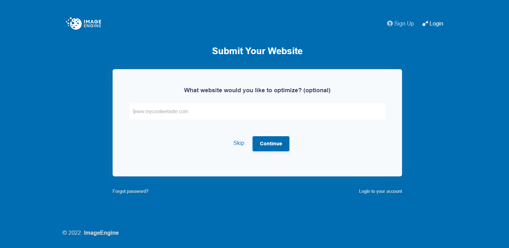
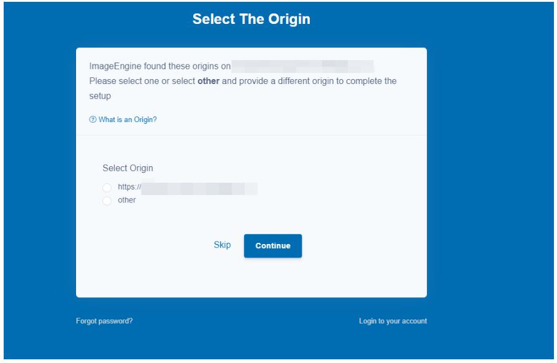
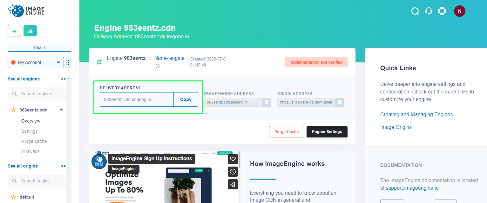
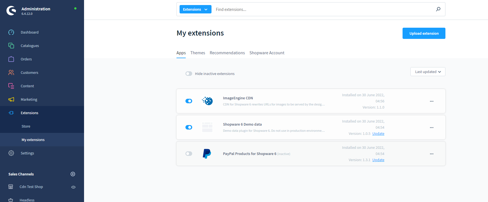
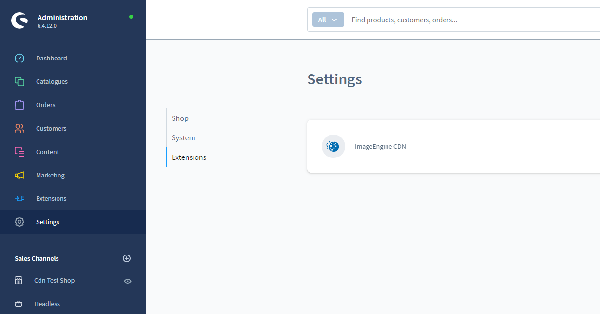
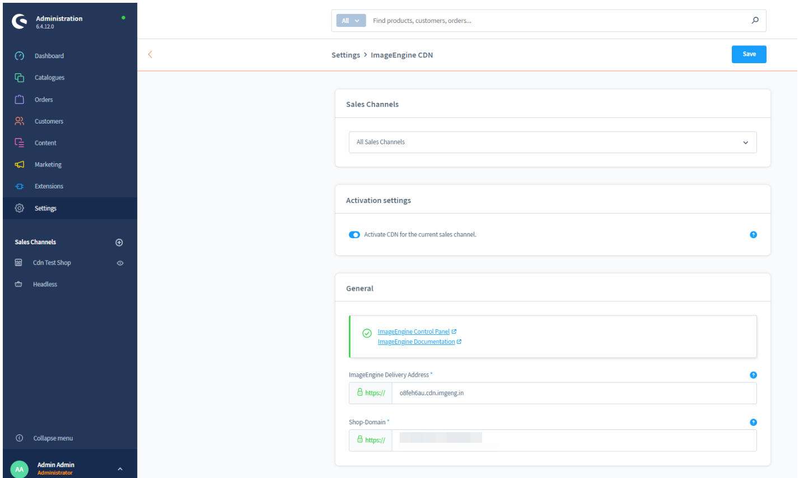
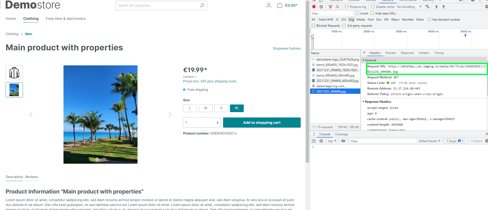

# shopware-plugin
An ImageEngine plugin for Shopware 6

Plugin Usage Instructions

In order to subscribe to the imageengine CDN account, please follow this link  
https://control.imageengine.io/register and enter your website

Create an account.
Select Origin. It is recommended to use your website’s url:

Copy Delivery address

Install the ImageEngine ShopWare plugin:
5.1 Download the plugin from the store or use an existent archive with the plugin
5.2 Log into your Shopware 6 administration area and navigate to Extensions -> My Extensions
5.3 Click the "Upload Plugin" button and select the extension downloaded.

Go to the Settings -> Extensions and click CDN plugin for the configuration

Select Sales Channel and activate the plugin.
Insert the url copied in step 4 above into the “ImageEngine Delivery Address” field and save the settings. The “Shop Domain” setting is the url of your website.

To verify the plugin is configured correctly, you can check the source url of the product image on the frontend and make sure it is loaded from the CDN server:

